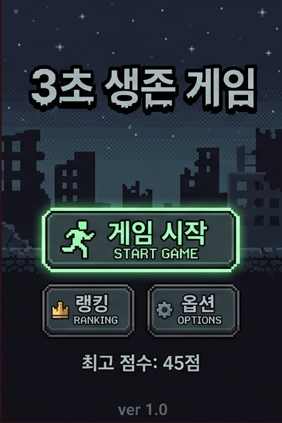
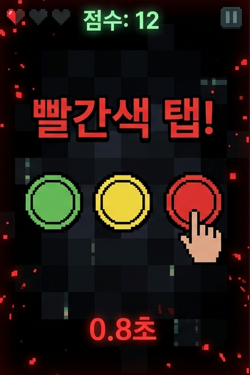

# 3초 생존 (3s Survive)

<p align="center">
  
  
</p>

무작위 미션을 **3초 안에** 클리어하면 생존, 실패하면 게임오버.
빠른 판단력과 반사신경을 시험하는 아포칼립스 세계관의 모바일 웹 미니게임입니다.

## 게임 플로우

```
미션 제시 (0.5초) → 플레이어 액션 (2.5초) → 성공/실패 판정 → 다음 미션 or 게임오버
```

## 주요 특징

- **135종 미니게임** — 탭, 스와이프, 롱프레스, 멀티탭, 컴포넌트 인터랙션 등 다양한 입력 방식
- **한/영 전환** — 기본 한국어, 설정에서 English 전환 가능
- **사운드 시스템** — Web Audio API 기반 SFX + BGM (개별 볼륨 조절)
- **최고 점수 저장** — localStorage 기반 스코어 트래킹
- **모바일 최적화** — 터치 인터랙션 중심, viewport-fit=cover
- **CRT 그린 톤 UI** — 레트로 아포칼립스 분위기

## 미션 카테고리

| 카테고리 | 예시 |
|---------|------|
| 시스템/해킹 | REBOOT, DEFRAG, KERNEL_PANIC, FIREWALL, BIOS_ERROR |
| 의료/생존 | HEARTBEAT, TRANSFUSE, ANTIDOTE, TOURNIQUET, QUARANTINE |
| 전투/전술 | GRENADE_PIN, BARRICADE, SCOPE, RELOAD, CLAYMORE_AIM |
| 통신/신호 | MORSE, BEACON, BROADCAST, SEMAPHORE, SIGNAL_INTERCEPT |
| 전자/회로 | SOLDER, CAPACITOR, CIRCUIT_BRIDGE, VOLTAGE_MATCH |
| 환경/탐색 | COMPASS, GEIGER, DUST_STORM, WATER_LEVEL, FORAGE |

## 기술 스택

- **Vue 3** + Composition API (`<script setup>`)
- **TypeScript**
- **Vite**
- **Vue Router 4**

외부 UI 라이브러리 없이 순수 CSS로 구현. 백엔드 없는 정적 SPA.

## 프로젝트 구조

```
src/
├── components/
│   ├── missions/        # 135개 미니게임 컴포넌트
│   ├── MainScreen.vue   # 홈 화면
│   ├── TimerBar.vue     # 3초 타이머
│   ├── MissionText.vue  # 미션 지시문
│   └── ...
├── composables/
│   ├── useGameState.ts  # 게임 루프 & 상태 머신
│   ├── useI18n.ts       # 다국어 시스템
│   ├── useAudio.ts      # 효과음
│   ├── useBgm.ts        # 배경음악
│   ├── useTimer.ts      # 타이머
│   └── ...
├── types/
│   ├── mission.ts       # 미션 타입 & 레지스트리
│   └── game.ts          # 게임 상태 타입
├── i18n/
│   └── en.ts            # 영문 번역
└── views/
    ├── HomeView.vue
    └── GameView.vue
```

## 시작하기

```bash
# 설치
npm install

# 개발 서버 (port 3334)
npm run dev

# 빌드
npm run build
```

## 라이선스

Private
